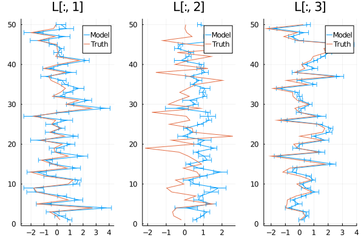

# LoadingMatrices.jl
*Lightweight Julia package to create loading matrices for factor analysis*

This is a small package to construct loading matrices for probabilistic [factor analysis](https://en.wikipedia.org/wiki/Factor_analysis) and dimensionality reduction.  These matrices can be used in more complex probabilistic models (in Turing, for instance); if you just need traditional factor analysis that's available in [MultivariateStats.jl])https://github.com/JuliaStats/MultivariateStats.jl).

## Factor analysis and LoadingMatrices
Factor analysis is a statistical method where an *n*-dimensional vector of correlated variables **x** is represented as a linear combination of a smaller number *m* of unobserved, uncorrelated "factors" **f**. The key to this representation is the *loading matrix* L, which maps the low-dimensional vector of factors to the higher-dimensional vector of data,

.

Alternatively, if we have multiple observations of **x**, we can collect them in the columns of a data matrix *X* and write the system of equations as

,

where *F* is a matrix with *m* rows and the same number of columns as *X*.  

Given a dataset *X*, there is no single unique way to do this decomposition, but we would like the columns of *L* to be linearly independent.  One easy way to do this is to force all entries above the diagonal to be zero.  `LoadingMatrices` exports two functions that can be used to construct matrices with this property:
* `nnz_loading(nx, nfactor)` calculates the number of nonzero entries in a lower-triangular matrix with size `(nx, nfactor)`.
* `loading_matrix(values, nx, nfactor)` arranges the numers in the vector `values` in the lower triangle of the matrix with the specified size.

```julia
julia> using LoadingMatrices

julia> nx = 5;

julia> nfactor = 3;

julia> nnz = nnz_loading(5, 3)
12

julia> L = loading_matrix(randn(nnz), nx, nfactor)
5×3 Array{Float64,2}:
 -1.3836     0.0         0.0
 -1.6667     0.436374    0.0
  0.285922  -0.0585805  -1.0485
  0.512425  -0.457097   -1.43772
 -2.74867   -0.128697    0.301587
```

This package also exports a function `varimax` (originally implemented by Haotian Li as part of [NGWP.jl](https://github.com/haotian127/NGWP.jl)) to perform the [varimax](https://en.wikipedia.org/wiki/Varimax_rotation) rotation on loading matrices.

## Baayesian factor analysis using Turing

This example shows how the utility functions in `LoadingMatrices.jl` make it easy to perform Bayesian probabilistic factor analysis in Turing.  This is a relatively simple use case, but it would be straightforward to add other layers and processes to the model (e.g. covariates, non-Gaussian observations, etc.).

```julia
using LoadingMatrices
using Random
using Plots
using Turing
# using Memoization and reverse-mode autodiff speeds up MCMC sampling
# *a lot* when fitting high-dimensional models
using Memoization
using ReverseDiff
Turing.setadbackend(:reversediff)

Random.seed!(1)

nx = 50
nfactor = 3
nobs = 300
σ = 0.5

vals = randn(nnz_loading(nx, nfactor))
L = loading_matrix(vals, nx, nfactor)

F = randn(nfactor, nobs)
X = L * F .+ σ*randn()

@model function FactorModel(X, nfactor)
    nx, nobs = size(X)
    # set priors for factors, loading matrix, and observation noise
    F ~ filldist(Normal(0, 1), nfactor, nobs)
    vals ~ filldist(Normal(0, 2), nnz_loading(nx, nfactor))
    σ ~ Exponential(1.0)

    L = loading_matrix(vals, nx, nfactor)
    X ~ arraydist(Normal.(L * F, σ))
end

mod = FactorModel(X, nfactor)
chn = sample(mod, NUTS(), 100)
```

Once the chain has completed sampling, we can extract and plot the posterior for the loading matrix.  Note that the matrix's values are sampled as a flat vector, so we have to reconstruct the matrices from them.

```julia
vals_post = Array(group(chn, :vals))
L_post = [loading_matrix(v, nx, 3) for v in eachrow(vals_post)]
```

Before comparing the matrices in `L_post` to the true `L`, we'll apply `varimax` to each one.  There's no guarantee that the model will fit the same combination of `L` and `F` we started with, but they should be the same (approximately) after applying a variance-maximizing rotation.

```
L_post_vm = varimax.(L_post)

plot(mean(L_post_vm), 1:nx, xerror=2std(L_post_vm), markerstrokecolor=1,
    layout=(1, 3), label="Model", title=["L[:, 1]" "L[:, 2]" "L[:, 3]"])
plot!(varimax(L), 1:nx, layout=(1, 3), label="Truth")
```


Columns 1 and 3 of the rotated matrix were recovered quite well by the model, though it struggled a bit with column 2.
